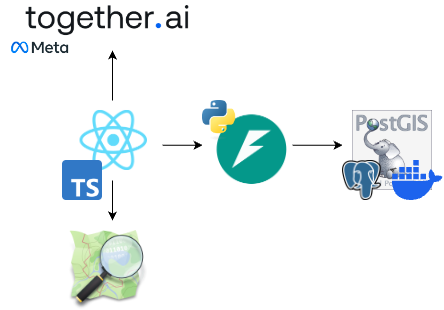

# constellation24

Repo for GitHub Constellation 2024 Hackathon

# What we're building

Feather is a community-driven platform that empowers South Africans to enhance their safety through collective awareness. The platform allows citizens to:

- Report incidents anonymously to build a comprehensive crime map
- Visualize crime patterns and hotspots in their neighborhoods
- Access safety information in their preferred local language
- Make informed decisions about travel routes and daily activities

Our mission is to transform raw incident data into actionable safety intelligence that helps communities stay informed and protected. By combining real-time reporting with geospatial visualization, we're creating a tool that serves both individuals and law enforcement in their efforts to improve public safety.

## Goals
- [x] Create a platform for people to report crime, anonymously
- [x] Visualize data on a map
- [x] Provide some way for users to chat with the app - focus on SA langauges
- [ ] _Stretch Goal_ Pull in data from other sources (e.g. police reports)
- [ ] _Stretch Goal_ Provide navigation to the nearest police station
- [ ] _Stretch Goal_ Provide navigation, taking crime data into account

## Pillars

### Community

- Built by and for South African communities
- Encourages active citizen participation and reporting
- Supports multiple languages to reach all community members
- Promotes collective responsibility for safety

### Safety

- Real-time incident reporting and alerts
- Crime pattern visualization and hotspot identification
- Privacy-focused design protecting user identities

### Intelligence

- AI-powered language processing for local language support
- Data-driven insights for informed decision-making

# How we're building it

## Tech Stack



1. Front-end: Streamlit (Python)
2. Back-end: FastAPI (Python)
3. Database: PostGIS (PostgreSQL on Docker)
4. Maps: OpenStreetMaps (through Leaflet.js/Folium)
5. Intelligence: (Meta Llama 3.2 on Together.ai)

### Architectural Decisions
*Why Postgres/PostGIS?*

We are storing geospatial data, so we need a database that can handle that.
Postgres is a great database, and PostGIS is an extension that adds geospatial functionality.

*Why Llama & Together.ai?*

Llama is _the_ premier open source family of AI models.
With it being open source, we can easily fine-tune it to better understand South African languages.
Together.ai provides a complete free tier for Llama 3.2 11B.
The alternative would be Google Gemini, which has a generous free tier.

## Open Source
Our project leverages several key open source technologies:

- **FastAPI**: Modern Python web framework for building APIs
- **Streamlit**: Open source framework for building data apps
- **PostGIS/PostgreSQL**: Open source spatial database
- **OpenStreetMaps/Leaflet.js**: Open source mapping capabilities
- **SQLModel**: Open source ORM built on SQLAlchemy
- **Llama**: Open source LLM family for natural language processing
- **Docker**: Containerization platform for consistent deployments

## Quality and Security

### Automated Testing
- **Pytest Framework**: Comprehensive test suite in [backend/tests](backend/tests) covering:
  - API endpoint testing
  - Database operations
  - Geospatial functionality
  - Authentication and authorization

### CI/CD Pipeline
Our [GitHub Actions workflows](.github/workflows) ensure code quality:

1. **Linting** ([lint.yml](.github/workflows/lint.yml)):
   - Black for code formatting
   - isort for import sorting
   - Flake8 for code style
   - Runs against Python 3.11, 3.12, and 3.13

2. **Build Testing** ([build.yml](.github/workflows/build.yml)):
   - Validates Docker builds
   - Ensures containerization works across environments

## AI Tools

Due to the time constraints, and being busy with "real life", we relied heavily on GitHub copilot during the development.
We used it for the following purposes:

- Ideation - fleshing out ideas
- Scaffolding - creating the initial structure of the project
- Editing - making small changes to code
- Testing - writing tests

_Note:_ to be 100% honest, we would not have been 25% as productive without copilot. It made it possible to build this at all as a two person team who also has full-time jobs.

# Local Dev

## Prerequisites

- Docker
- Python 3.12+

## Setup

1. Clone the repo

2. Set up the Python environment

```bash
python -m venv .venv
source .venv/bin/activate
```

1. Install the python dependencies
```bash
pip install -r backend/requirements.txt
```

1. Run `docker-compose up db -d` to start the database

3. Run the backend
```bash
fastapi run backend/src/main.py
```

4. Install the frontend dependencies
```
cd frontend
pnpm install
```

6. Run the frontend
```bash
cd frontend
pnpm dev
```

### Executing Tests
```bash
pytest backend/tests
```